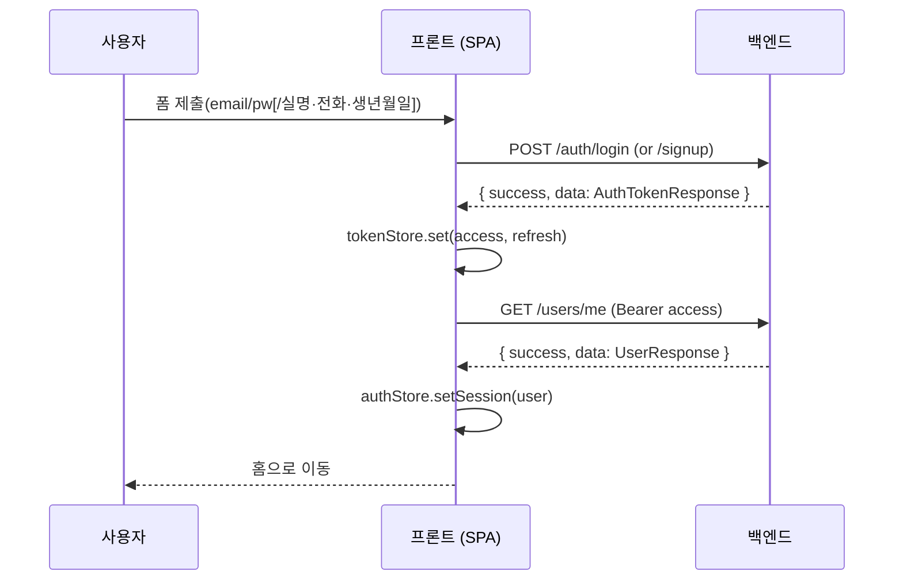
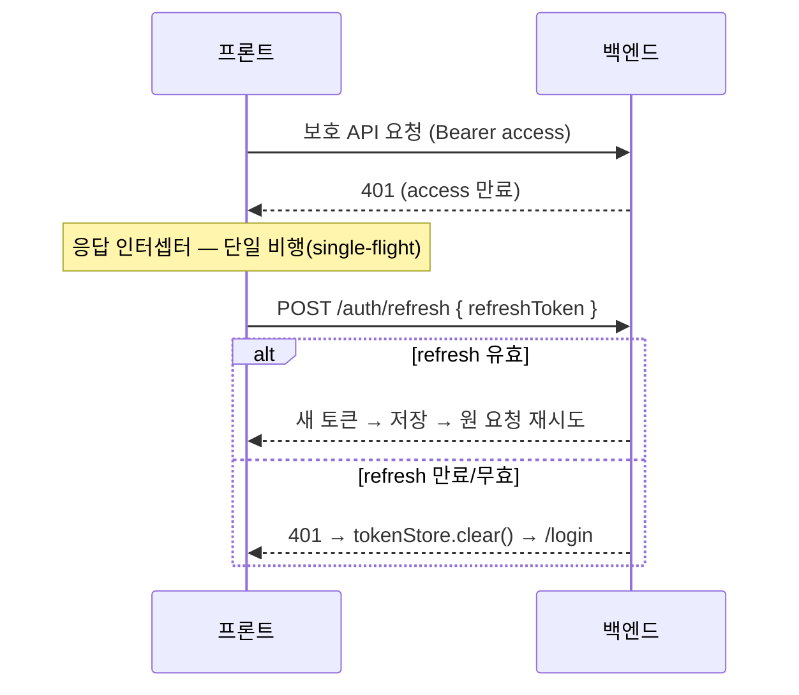

# 인증 프로세스 (JWT 발급 + OAuth) — FE ↔ BE 연결 명세

> BloomTalk 인증 흐름을 정리하고, 프론트엔드를 실제 백엔드 계약에 배선하기 위한 문서.
> 백엔드는 이미 JWT 발급·검증·OAuth·refresh 회전을 **모두 구현**해 두었다(`domain/auth`, `global/security`).
> 이 문서는 그 계약을 프론트에 어떻게 연결하는지와, 연결을 막는 **갭 3개**를 정리한다.

## 1. 토큰 모델

| 항목 | 값 | 근거 |
|---|---|---|
| Access Token | JWT, `Authorization: Bearer <access>` 헤더로 전송 | `JwtAuthenticationFilter` |
| Refresh Token | 서버 저장(`RefreshToken` 엔티티), 재발급·로그아웃에 사용 | `AuthService.refresh/logout` |
| 발급 응답 | `{ tokenType, accessToken, accessTokenExpiresIn, refreshToken, refreshTokenExpiresIn }` | `AuthTokenResponse` |
| 만료(초) | `auth.jwt.accessTokenValiditySeconds` / `refreshTokenValiditySeconds` | `JwtProperties` |
| 세션 정책 | STATELESS (서버 세션 없음) | `SecurityConfig` |
| 클라 저장 | MVP: `localStorage`(`bd_access_token` / `bd_refresh_token`) | `shared/api/tokens.ts` |

응답 유저 정보가 토큰 본문에 없음 → 로그인 직후 `GET /api/v1/users/me` 로 신원을 채운다.

## 2. 엔드포인트 (base: `/api/v1`)

| 메서드 | 경로 | 공개 | 요청 | 응답(data) |
|---|---|---|---|---|
| POST | `/auth/signup` | ✅ | `{email, password, realName, phoneNumber?, birthDate}` | `AuthTokenResponse` (201) |
| POST | `/auth/login` | ✅ | `{email, password}` | `AuthTokenResponse` |
| POST | `/auth/refresh` | ✅ | `{refreshToken}` | `AuthTokenResponse` |
| POST | `/auth/logout` | 🔒 | `{refreshToken}` | `null` |
| GET | `/auth/oauth2/{provider}` | ✅ | — | 302 → provider (state 쿠키 set) |
| GET | `/auth/oauth2/{provider}/callback` | ✅ | `?code&state` (+state 쿠키) | `AuthTokenResponse` (JSON) |
| POST | `/auth/password/reset-request` | ✅ | `{email}` | `null` (202) |
| PATCH | `/auth/password/reset` | ✅ | `{token, newPassword}` | `null` |
| DELETE | `/auth/account` | 🔒 | `{password}` | `null` |
| GET | `/users/me` | 🔒 | — | `UserResponse` |

- **제공자**: `google`, `naver` (경로엔 소문자, 백엔드 `OAuthProvider` = GOOGLE/NAVER)
- **성공 래퍼**: 모든 성공 응답은 `{ success: true, data }` — FE에서 `data.data` 로 언랩
- **에러 래퍼**: `{ success: false, code, message, errors:[{field, rejectedValue, reason}], timestamp, path }`

## 3. 흐름

### 회원가입 / 로그인 (JWT 발급)


### 인증 요청 + 자동 재발급 (refresh 회전)


### 로그아웃
`POST /auth/logout {refreshToken}` 로 서버 refresh 무효화 → 성공/실패와 무관하게 `tokenStore.clear()` + 스토어 초기화 → `/login`.

## 4. 프론트 배선 매핑

| 파일 | 역할 | 상태 |
|---|---|---|
| `features/auth/types.ts` | 백엔드 계약 타입(AuthTokens/MeResponse/…) | ✅ 추가됨 |
| `features/auth/api.ts` | signup·login·refresh·logout·getMe·oauthStart | ✅ 추가됨 |
| `shared/api/axios-augment.d.ts` | `skipAuthRefresh` 설정 플래그 타입 보강 | ✅ 추가됨 |
| `shared/api/client.ts` | 요청 시 Bearer 첨부 + **401 refresh 단일 비행** | ✅ 인터셉터 확장 |
| `shared/api/tokens.ts` | 토큰 저장(localStorage) | ✅ 기존 |
| `stores/auth.store.ts` | `signIn`(토큰 저장+`getMe`) · `hydrate`(부팅 복원) · `signOut` | ✅ 확장 |
| `main.tsx` | 부팅 시 `hydrate()` 호출 | ✅ 배선 |
| `features/auth/LoginPage.tsx` | 로그인 폼 → `login()`+`signIn()`, 소셜 → `oauthStart()` | ✅ 배선 |
| `features/auth/SignupPage.tsx` | 가입 폼 → `signup()`+`signIn()` (+ **생년월일 필드**) | ✅ 배선 |
| `features/home/HomePage.tsx` | 로그아웃 → `signOut()`(서버 refresh 무효화) | ✅ 배선 |

## 5. 확인된 갭 (연결 전 처리 필요)

1. **회원가입 생년월일 미수집** — 백엔드 `signup` 은 `birthDate`(`@NotNull @Past`) 필수인데
   현재 `SignupPage` 는 email·pw·실명·전화만 수집한다. → 가입 폼에 생년월일 입력 추가.
   (성인 인증/연령대 계산 근거이기도 함)
2. **응답 래퍼·경로 버전 불일치** — 기존 `features/room/api.ts` 는 `{success,data}` 언랩을 안 하고
   구경로 `/sessions/...`(→`/api/sessions`)를 쓴다. 현행 백엔드는 `/api/v1/...` + 래퍼.
   → auth 모듈은 `/v1/...` + 지역 언랩으로 정확히 배선(전역 언랩은 room 호출과 충돌하므로 지양). room/api 는 별도 정리 대상.
3. **OAuth 콜백이 JSON 을 반환** — provider redirect-uri 가 **백엔드 콜백**으로 설정돼 있어
   (`http://localhost:8080/api/v1/auth/oauth2/{provider}/callback`) 콜백이 `AuthTokenResponse` JSON 을 그대로 반환한다.
   최상위 브라우저가 리다이렉트되므로 사용자는 **JSON 페이지에 착지**하고 SPA 는 토큰을 받지 못한다.
   → **백엔드 조율 필요**: 콜백이 FE 라우트로 302 리다이렉트하며 토큰을 전달(해시 프래그먼트) 하거나
   httpOnly 쿠키로 세팅하도록 변경. 그 전까지 FE 는 `oauthStart()`(시작 이동)까지만 배선 가능.
   변경 확정 시 FE 에 `/oauth/callback` 라우트를 추가해 토큰을 수신·저장한다.

## 6. 배선 완료 (브랜치 `feature/#10-auth-login`)

- [x] `client.ts` 401 인터셉터: refresh 단일 비행, `skipAuthRefresh`/로그인·리프레시 경로 제외, 실패 시 clear+`/login`
- [x] `auth.store.ts`: `signIn(tokens)`(저장 후 `getMe` 하이드레이션) / `hydrate()`(부팅 복원) / `signOut()`(logout 호출+clear)
- [x] `main.tsx`: 부팅 시 `hydrate()` 호출
- [x] `LoginPage`: onSubmit → `login()`+`signIn()`; Google/Naver → `oauthStart('google'|'naver')`; 실패 시 danger Callout
- [x] `SignupPage`: 생년월일 필드(만 19세 게이트) 추가 → onSubmit → `signup()`+`signIn()` → `/signup/verify`
- [x] `npm run build`(tsc -b && vite build) + `npm run lint` 통과

### 남은 후속 (별도 처리)
- [ ] **갭 #3 OAuth 콜백 리다이렉트** — 백엔드가 FE 라우트로 302(+토큰) 하도록 변경되면 FE `/oauth/callback` 라우트 추가
- [ ] `features/room/api.ts` — `/v1/...` 경로 + `{success,data}` 언랩으로 현행 백엔드에 맞춰 정리(auth 와 별개 도메인)
- [ ] 프로필 닉네임 확정 후 `toAuthUser`의 표시명을 실명 → 닉네임으로 교체

## 7. 로컬 검증 (스모크 테스트) 절차

목적: **이메일/비밀번호 경로**가 실제로 토큰을 발급하고 refresh 로 회전하는지 확인. (소셜은 §5 갭으로 제외)

### 전제 — DB 준비 (1회)
로컬 MySQL 8 이 떠 있어야 한다(`date` DB + 접속 계정). 네이티브 설치 기준:
```sql
CREATE DATABASE IF NOT EXISTS `date` CHARACTER SET utf8mb4 COLLATE utf8mb4_unicode_ci;
CREATE USER IF NOT EXISTS 'date'@'localhost' IDENTIFIED WITH mysql_native_password BY 'date';
GRANT ALL PRIVILEGES ON `date`.* TO 'date'@'localhost';
FLUSH PRIVILEGES;
```
> `mysql_native_password` 로 만들면 커넥터의 public-key-retrieval 이슈를 피한다.

### 실행 순서와 각 단계가 증명하는 것
| 단계 | 명령/요청 | 성공 판정 | 무엇을 증명하나 |
|---|---|---|---|
| ① 백엔드 기동 | `DB_USERNAME=date DB_PASSWORD=date gradlew bootRun` | 로그에 Flyway `V1~V5` + `Started BackendApplication` | DB 연결·마이그레이션 |
| ② 헬스 | `GET /actuator/health` | `{"status":"UP"}` | 서버 살아있음 |
| ③ 회원가입 | `POST /api/v1/auth/signup` {email,password,realName,phoneNumber,birthDate} | `201` + `{success,data:{accessToken,refreshToken,...}}` | **JWT 발급** |
| ④ 로그인 | `POST /api/v1/auth/login` {email,password} | `200` + 토큰 | 자격 검증·재발급 |
| ⑤ 신원 | `GET /api/v1/users/me` (Bearer access) | `200` + `{userId,email,role,...}` | **토큰 인증(필터)** + 하이드레이션 소스 |
| ⑥ 재발급 | `POST /api/v1/auth/refresh` {refreshToken} | `200` + 새 토큰 | **refresh 회전** |
| ⑦ 무권한 | `GET /api/v1/users/me` (토큰 없음) | `401` | 보호 라우트 게이트 |
| ⑧ 로그아웃 | `POST /api/v1/auth/logout` {refreshToken} (Bearer) | `200`; 이후 그 refreshToken 재사용 시 실패 | refresh 무효화 |

### 프론트 확인 (선택)
`npm run dev` → `/signup` 에서 실제 가입 → 홈 진입(닉네임=실명 표시) → 새로고침해도 유지(`hydrate`) → 로그아웃. DB에 `users` 행 생성 확인.

> ⚠️ FE "이메일 중복 확인" 버튼은 스텁(백엔드에 check-email 없음). 실제 중복은 ③ 제출 시 서버가 막고 FE 가 이메일 필드로 매핑.
