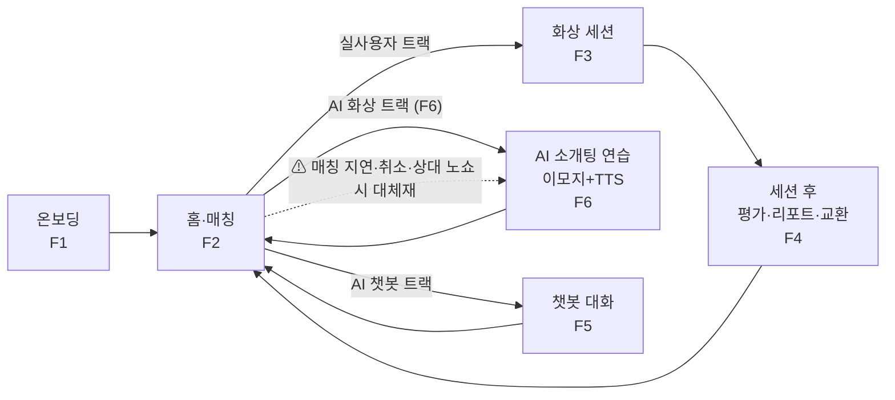
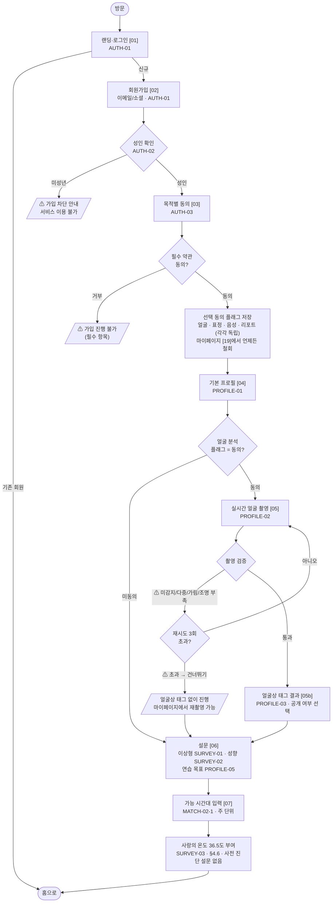
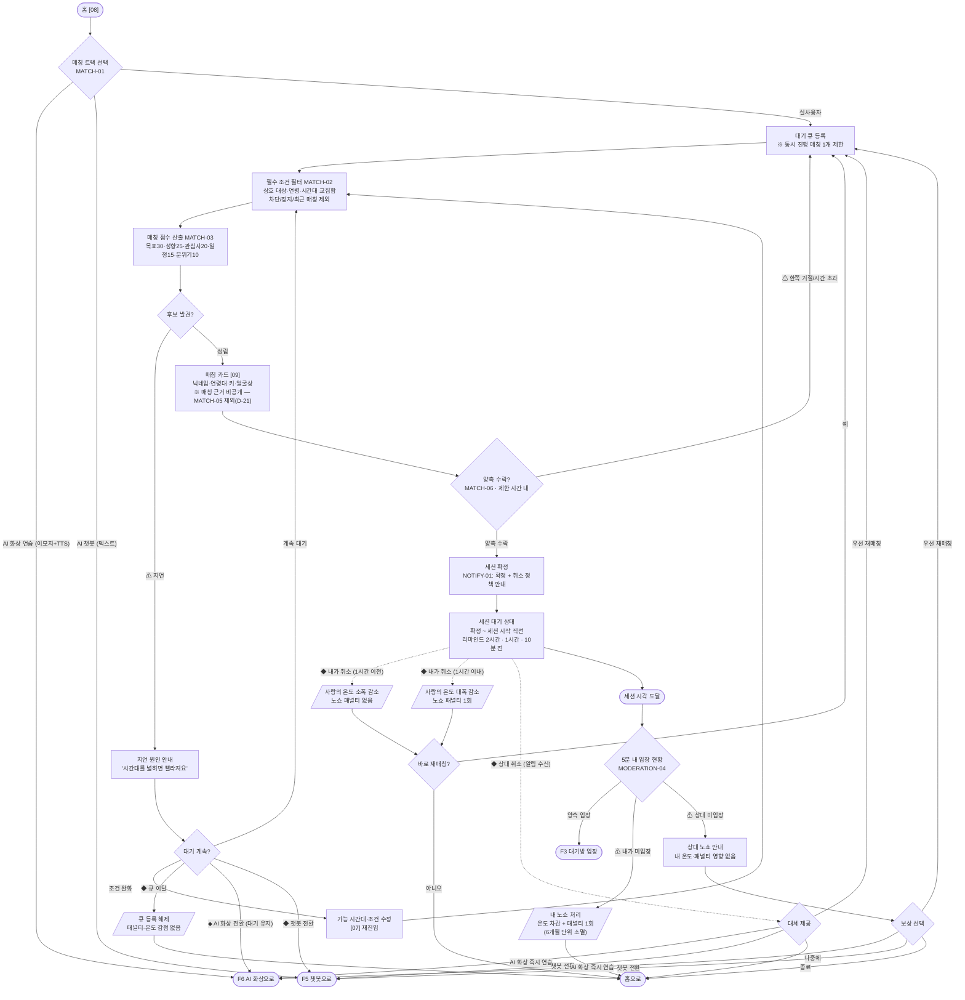
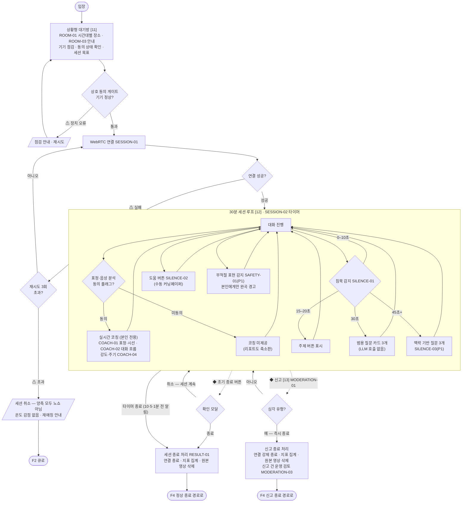
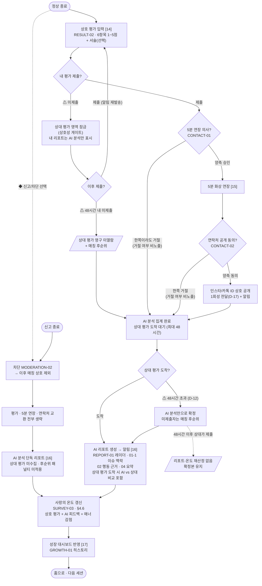
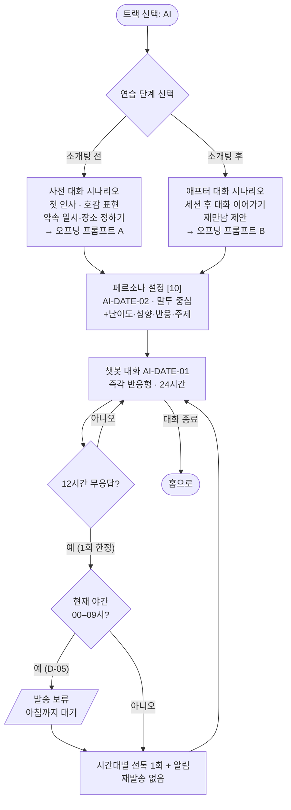
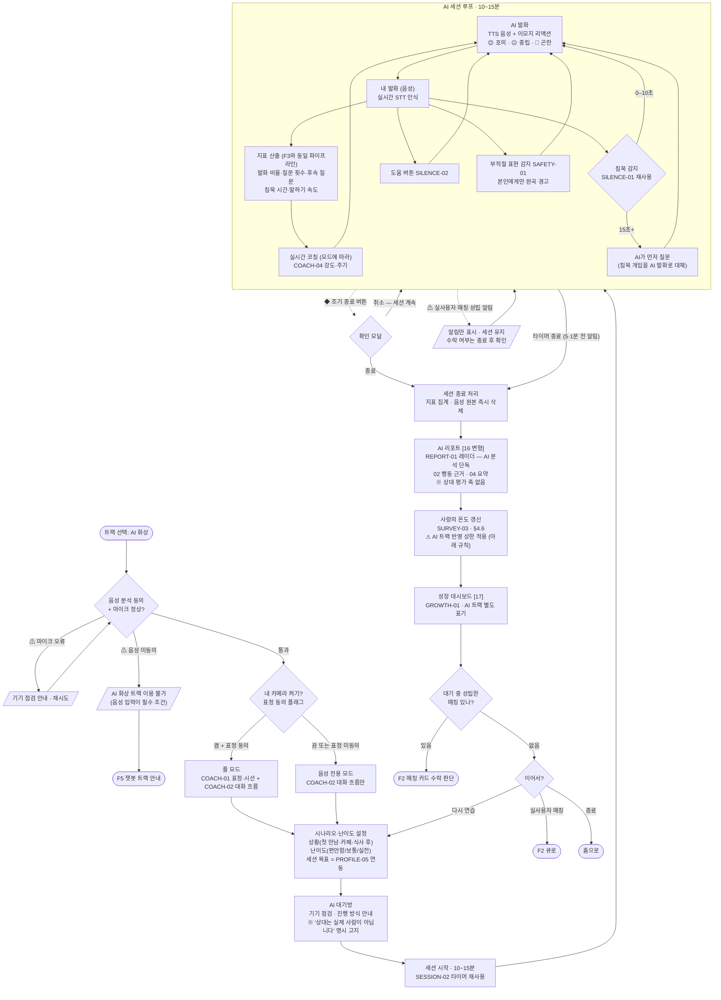

# 유저플로우 v1.2

> 근거: `기능명세서_v2.md` §2 전체 흐름 + 각 기능 상세 · 작성일 2026-07-19 · 수정 2026-07-21
> **결정 전제(월요일 결정 회의에서 뒤집히면 이 문서도 수정):**
> D-01=C안(관심사 매칭 전용 수집·미노출) · D-07=CONTACT-01 통합(P0) · D-12=48시간 후 AI 단독 확정 · D-17=1회성 전달
>
> **v3 확정 반영(v1.1):**
> - **D-03 = "사랑의 온도" 단일 점수 체계**(`SURVEY-03` · §4.6, 기본 36.5도). v1.0의 "연습 레벨·경험치" 표기는 전부 폐기.
> - **D-21 = 매칭 근거 비공개 확정**(`MATCH-05` 제외 유지). 매칭 카드에 근거 문장을 노출하지 않는다.
>
> **⚠️ v1.2 — D-04 재결정 전제(명세 미반영 상태):**
> 본 문서는 **AI 화상 트랙(F6)을 P1로 채택한 안**을 그린다. 그러나 `기능명세서_v3.md`의 현행 확정은
> **D-04 = AI 화상 트랙 P2 보류**(부록 A `AI-DATE-02`(구) 제외)이다. **F6은 아직 승인되지 않은 제안**이며,
> D-04를 재논의해 뒤집기 전까지는 이 문서가 명세를 앞서 있다. 회의에서 부결되면 **F6 전체와 F2의 AI 화상 분기를 되돌린다.**
>
> 표기: `[화면]` = 와이어프레임 화면 번호(`와이어프레임.html` 참조) · ◆ = 분기 · ⚠ = 이탈/실패 경로

---

## 0. 전체 서비스 맵

---

## F1. 온보딩 — 가입부터 매칭 가능 상태까지

**핵심 규칙**
- 선택 동의를 **모두 거부해도** 기본 화상 연습(홈 진입·매칭·세션)은 가능하다. 거부 시 해당 AI 분석 기능만 비활성(세션 중 코칭 미제공, 리포트는 지표 기반 축소판).
- 얼굴 분석 거부 시 얼굴상 태그 없음 → 매칭의 "선호 분위기 적합도"는 키·자기소개만으로 계산.
- **선택 동의 4종은 각각 독립 플래그**이며, 이후 플로우에서 아래와 같이 소비된다. 동의 화면에서 분기시키지 않고 **플래그를 저장한 뒤 사용 시점마다 게이트**한다.

| 플래그 | 소비 지점 | 미동의 시 |
|---|---|---|
| 얼굴 | F1 `FACE` 게이트 | 촬영·얼굴상 태그 생략 |
| 표정 | F3 `CGATE2` 게이트 | 표정·시선 코칭(COACH-01) 미제공 |
| 음성 | F3 `CGATE2` 게이트 | 대화 흐름 코칭(COACH-02)·발화 지표 미산출 |
| 리포트 | F4 리포트 생성 | 리포트 축소판(수치 지표만, 행동 근거 인용 없음) |

- 온보딩 중 이탈 시 **입력분은 임시 저장**하고, 재로그인 시 마지막 단계부터 재개한다. 온도 부여(`TEMP`)까지 완료해야 매칭 가능 상태가 된다.

---

## F2. 매칭 — 트랙 선택부터 세션 확정까지

**핵심 규칙**
- **취소는 확정 직후부터 세션 시작 전까지 언제든 가능**하다. 리마인드 발송 여부와 무관하며, 패널티는 오직 **세션 시작 1시간 기준**으로만 갈린다(§6.2.1).
- 취소·노쇼 후 **자동으로 큐에 재등록하지 않는다.** 재매칭 여부는 항상 사용자가 선택한다.
- **상대 노쇼·상대 취소는 내 온도와 노쇼 패널티에 영향을 주지 않는다.** 피해자에게는 우선 재매칭 또는 챗봇 전환을 제공한다.
- 큐 대기 중 이탈은 언제든 가능하며 패널티가 없다. 이탈 시 `동시 진행 매칭 1개 제한` 슬롯도 함께 해제된다.
- **AI 화상 전환(F6)은 대기 큐를 유지한 채 진행**한다. 연습 도중 매칭이 성립하면 알림만 띄우고, **수락 여부는 AI 세션 종료 후에 묻는다**(세션 중 강제 이탈 없음). 반면 챗봇 전환(F5)·큐 이탈은 슬롯을 해제한다.

---

## F3. 화상 세션 — 대기방부터 종료까지 (화면 테마: 다크 고정)

**핵심 규칙**
- **표정·음성 동의 플래그는 세션 진입 시 1회 평가**한다(`CGATE2`). 세션 중 변경되지 않으며, 미동의자는 코칭 없이 대화만 진행한다.
- 조기 종료 확인 모달에서 **취소하면 세션이 그대로 이어진다.** 조기 종료는 노쇼가 아니며, 진행된 구간까지의 지표로 리포트를 생성한다.
- WebRTC 연결이 3회 실패하면 **양측 모두 노쇼·온도 감점 없이** 세션을 취소한다(귀책이 사용자에게 없음).
- **심각 유형 신고로 종료된 세션은 상호 평가·5분 연장·연락처 교환을 건너뛴다**(F4 신고 종료 경로). 가해자에게 평가·연장 기회를 주지 않기 위함이다.

---

## F4. 세션 후 — 평가 · 리포트 · 연락처 교환

**핵심 규칙**
- **리포트 생성은 단 한 번**이다. `WAITP`에서 상대 평가를 최대 48시간 대기한 뒤 확정 생성하며, "먼저 만들고 나중에 완성판을 다시 만드는" 2단계가 아니다. 대기 중에는 AI 분석 진행 상태만 노출한다.
- **48시간 경과 후 확정된 리포트는 상대가 뒤늦게 제출해도 재산정하지 않는다**(`NOUPD`). 온도도 갱신하지 않는다.
- **상호성 게이트는 영구 잠금이 아니다.** 미제출 상태에서도 내 AI 분석 리포트는 열람 가능하며, 48시간 내 제출하면 상대 평가가 열린다. 미제출로 확정되면 상대 평가는 영구 미열람 + 매칭 후순위.
- **신고 종료·차단 경로는 평가·연장·연락처 단계를 건너뛰고 곧바로 AI 단독 리포트로 간다.** 이 경로에서는 신고자에게 온도 감점을 적용하지 않으며, 피신고자 제재는 `MODERATION-03` 운영 검토를 따른다.

---

## F5. AI 챗봇 트랙 (텍스트 전용 · 화상 없음)

---

## F6. AI 화상 소개팅 연습 (이모지 + TTS) — *D-04 재결정 전제 · P1 제안*

> **트랙 정의:** AI 상대가 **TTS 음성 + 이모지 리액션**으로 소개팅 상황을 연출하고, 사용자는 **음성으로 답변**한다.
> 아바타·얼굴 렌더링은 없다(`AI-DATE-03` 제외 유지). 화면 테마는 F3와 동일하게 **다크 고정**.
>
> **존재 이유:** 매칭 지연·상대 취소·상대 노쇼 시 **동급의 대체재**를 제공하고, 신규 사용자의 첫 경험을 "대기 화면"이 아닌 "즉시 연습"으로 만든다.

**핵심 규칙**

- **음성 분석 동의는 이 트랙의 필수 조건**이다. 미동의자는 입력 수단이 없으므로 트랙 자체를 이용할 수 없고, 텍스트 챗봇(F5)으로 안내한다. (F1 플래그 표의 "음성" 항목 소비 지점이 하나 늘어난다.)
- **카메라는 선택**이다. 켜면 풀 모드로 `COACH-01` 표정·시선 코칭이 붙는다. 단 상대가 이모지이므로 **"시선 유지"의 기준은 "상대 얼굴 응시"가 아니라 "화면 응시"** 로 완화한다 — F3의 시선 지표와 **동일 축으로 비교하면 안 된다.**
- **리포트에는 상대 평가 축이 없다.** `REPORT-01` 레이더는 AI 분석 단독으로 그리며, F3/F4 리포트와 겹쳐 보여줄 때 **비교 가능 지표(발화 비율·질문 횟수·침묵)와 비교 불가 지표(매너·상대 체감)를 시각적으로 분리**한다.
- **음성 원본은 세션 종료 즉시 삭제**한다(§22 저장 원칙). 지표와 리포트만 남긴다.
- **AI임을 명시 고지**한다. 대기방과 세션 화면 모두에 "상대는 실제 사람이 아닙니다"를 상시 노출한다.
- 실사용자 매칭이 세션 도중 성립하면 **알림만 띄우고 세션을 끊지 않는다.** 수락 판단은 종료 후 `PEND`에서 한다.

**⚠️ 미결정 — 온도 반영 상한 (신규)**

AI 세션 결과를 사랑의 온도에 **반영하기로 결정**했으나, AI 상대는 **무한 반복이 가능**하므로 상한 없이 반영하면 온도가 실력 지표로서 의미를 잃는다(파밍). 아래 중 하나를 확정해야 한다.

| 안 | 내용 | 비고 |
|---|---|---|
| **A (권장)** | **일/주 단위 반영 횟수 상한** (예: 주 3회까지만 온도 반영, 초과분은 리포트만 제공) | 파밍 차단 + 연습 동기 유지 |
| B | AI 세션은 **가중치 축소 반영** (실사용자 세션의 30~50%) | 상한 관리 불필요하나 체감이 모호 |
| C | AI 세션은 **가점만, 감점 없음** | 연습 부담은 낮으나 단조 상승 |

> 상한값·가중치 수치는 D-03의 잔여 항목(산정식 가중치)과 함께 확정해야 한다.

**F3(실사용자)와의 차이 요약**

| 항목 | F3 실사용자 | F6 AI 화상 |
|---|---|---|
| 세션 길이 | 30분 | **10~15분** |
| 상대 표현 | 실시간 영상 | **TTS 음성 + 이모지** |
| 내 입력 | 음성 + 영상 | **음성** (영상은 선택) |
| 침묵 개입 | 4단계(주제 버튼→질문 카드→RAG) | **AI가 직접 질문**(1단계) |
| 코칭 | COACH-01/02 | COACH-02 (+ 카메라 시 01) |
| 세션 후 | 상호 평가 → 연장 → 연락처 → 리포트 | **리포트 직행** (평가·연장·연락처 없음) |
| 온도 반영 | 전량 | **상한 적용** (위 미결정) |
| 노쇼·패널티 | 있음 | **없음** |

---

## 부록: 분기 커버리지 체크리스트

`개발착수_권장사항.md` §1.1에서 요구한 분기가 모두 포함됐는지 확인용.

| 분기 | 위치 | 상태 |
|---|---|---|
| 미성년 차단 | F1 | ✅ |
| 선택 동의 거부 (기능 축소 경로) | F1 | ✅ |
| 얼굴 촬영 실패 (미감지·다중·가림·조명) | F1 | ✅ |
| 매칭 지연 안내 | F2 | ✅ |
| 수락 거절/시간 초과 → 큐 재등록 | F2 | ✅ |
| 취소 시점별 패널티 (1시간 기준) | F2 | ✅ |
| 상대 취소 → 대체 매칭/챗봇 전환 | F2 | ✅ |
| 노쇼 (5분 대기) | F2 | ✅ |
| WebRTC 연결 실패 재시도 | F3 | ✅ |
| 침묵 4단계 개입 | F3 | ✅ |
| 조기 종료 / 세션 중 신고 | F3 | ✅ |
| 상호성 게이트 (평가 미제출 잠금) | F4 | ✅ |
| 상대 48시간 미제출 → AI 단독 확정 | F4 | ✅ |
| 5분 연장/연락처 한쪽 거절 (거절 비노출) | F4 | ✅ |
| 챗봇 선톡 1회 제한 + 야간 보류 | F5 | ✅ |

**v1.1에서 추가된 분기** — v1.0 체크리스트가 "반대편 당사자·복구 경로"를 누락하고 있었음.

| 분기 | 위치 | 상태 |
|---|---|---|
| 얼굴 촬영 3회 실패 → 건너뛰기 | F1 | ✅ |
| 표정·음성 미동의 → 코칭 미제공 경로 | F3 | ✅ |
| 큐 대기 이탈 / 조건 완화 재검색 | F2 | ✅ |
| 취소·노쇼 후 재매칭 여부 사용자 선택 | F2 | ✅ |
| **상대 노쇼 시 피해자 경로**(무패널티 + 보상) | F2 | ✅ |
| WebRTC 3회 실패 → 양측 무귀책 취소 | F3 | ✅ |
| 조기 종료 모달 취소 → 세션 복귀 | F3 | ✅ |
| **신고 종료 → 평가·연장·연락처 생략 경로** | F3·F4 | ✅ |
| 평가 잠금 해제(48시간 내 지연 제출) | F4 | ✅ |
| 차단 이후 리포트 처리 | F4 | ✅ |
| 48시간 확정 후 지각 제출 → 재산정 없음 | F4 | ✅ |
| 챗봇 연습 단계별 시나리오 분기 | F5 | ✅ |

**v1.2에서 추가된 분기** — AI 화상 트랙(F6) 신설분. *D-04 재결정 전제.*

| 분기 | 위치 | 상태 |
|---|---|---|
| 트랙 3분기 (실사용자 / AI 화상 / AI 챗봇) | F2 | ✅ |
| 매칭 지연 → AI 화상 전환 (큐 유지) | F2·F6 | ✅ |
| 상대 취소·상대 노쇼 → AI 화상 즉시 연습 | F2·F6 | ✅ |
| 음성 미동의 → 트랙 이용 불가 → 챗봇 안내 | F6 | ✅ |
| 마이크 오류 → 점검·재시도 | F6 | ✅ |
| 카메라 ON/OFF → 풀 모드 / 음성 전용 모드 | F6 | ✅ |
| AI 세션 중 매칭 성립 → 알림만, 종료 후 수락 판단 | F6 | ✅ |
| AI 세션 조기 종료 + 모달 취소 복귀 | F6 | ✅ |
| AI 침묵 개입 (AI가 먼저 질문) | F6 | ✅ |
| AI 리포트 (상대 평가 축 없음) | F6 | ✅ |
| 온도 반영 상한 | F6 | ⚠️ **미결정** |
