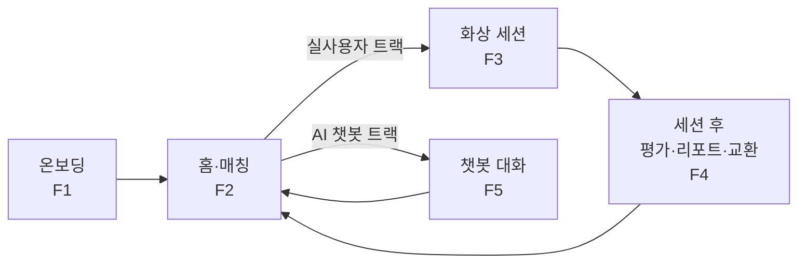
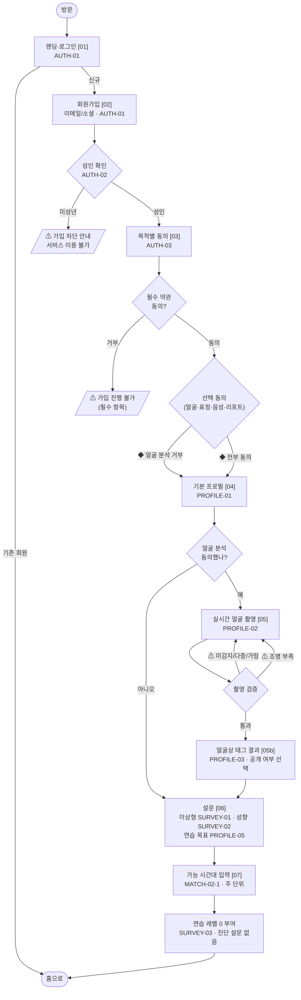
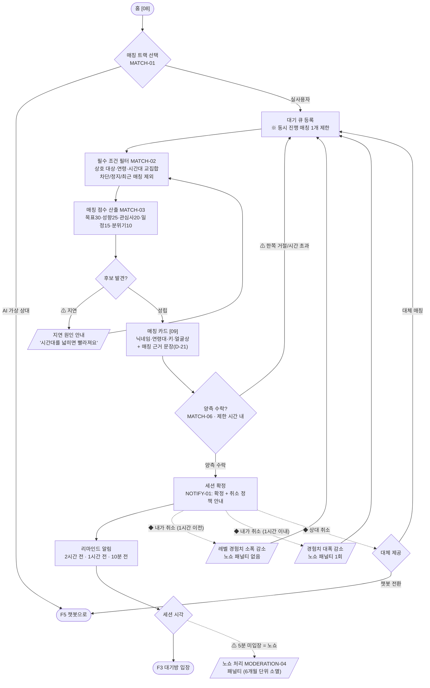
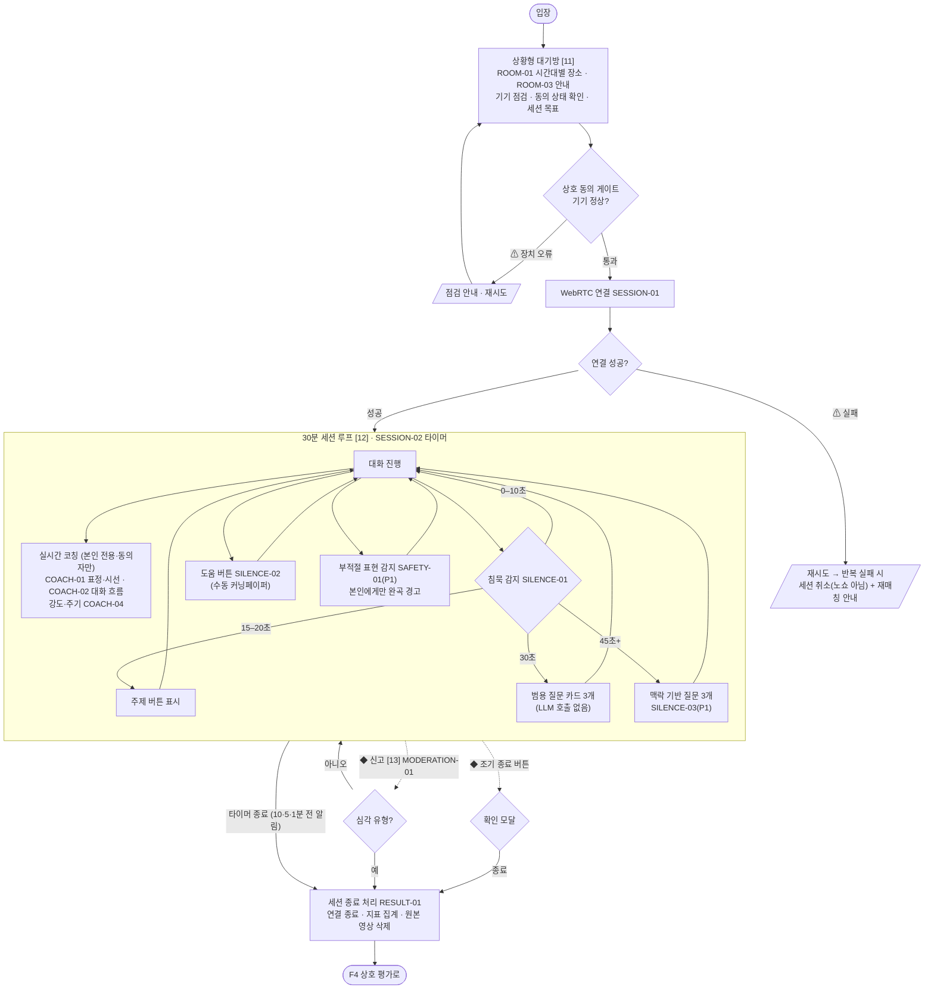
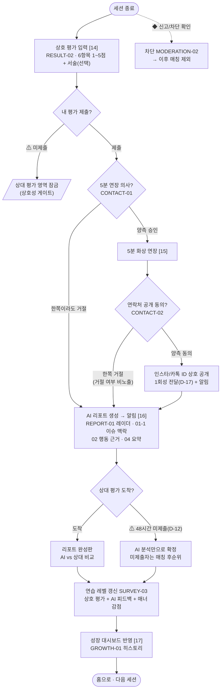
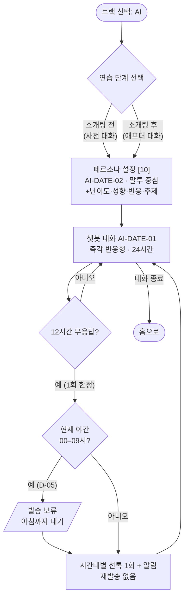

# 유저플로우 v1.0

> 근거: `기능명세서_v2.md` §2 전체 흐름 + 각 기능 상세 · 작성일 2026-07-19
> **결정 전제(월요일 결정 회의에서 뒤집히면 이 문서도 수정):**
> D-01=C안(관심사 매칭 전용 수집·미노출) · D-03=단일 "연습 레벨" · D-04=A안(팀원 시연) · D-07=CONTACT-01 통합(P0) · D-12=48시간 후 AI 단독 확정 · D-17=1회성 전달 · D-21=매칭 근거 P0 복원
>
> 표기: `[화면]` = 와이어프레임 화면 번호(`와이어프레임.html` 참조) · ◆ = 분기 · ⚠ = 이탈/실패 경로

---

## 0. 전체 서비스 맵

---

## F1. 온보딩 — 가입부터 매칭 가능 상태까지

**핵심 규칙**
- 선택 동의를 **모두 거부해도** 기본 화상 연습(홈 진입·매칭·세션)은 가능하다. 거부 시 해당 AI 분석 기능만 비활성(세션 중 코칭 미제공, 리포트는 지표 기반 축소판).
- 얼굴 분석 거부 시 얼굴상 태그 없음 → 매칭의 "선호 분위기 적합도"는 키·자기소개만으로 계산.

---

## F2. 매칭 — 트랙 선택부터 세션 확정까지

---

## F3. 화상 세션 — 대기방부터 종료까지 (화면 테마: 다크 고정)

---

## F4. 세션 후 — 평가 · 리포트 · 연락처 교환

---

## F5. AI 챗봇 트랙 (텍스트 전용 · 화상 없음)

---

## 부록: 분기 커버리지 체크리스트

`개발착수_권장사항.md` §1.1에서 요구한 분기가 모두 포함됐는지 확인용.

| 분기 | 위치 | 상태 |
|---|---|---|
| 미성년 차단 | F1 | ✅ |
| 선택 동의 거부 (기능 축소 경로) | F1 | ✅ |
| 얼굴 촬영 실패 (미감지·다중·가림·조명) | F1 | ✅ |
| 매칭 지연 안내 | F2 | ✅ |
| 수락 거절/시간 초과 → 큐 재등록 | F2 | ✅ |
| 취소 시점별 패널티 (1시간 기준) | F2 | ✅ |
| 상대 취소 → 대체 매칭/챗봇 전환 | F2 | ✅ |
| 노쇼 (5분 대기) | F2 | ✅ |
| WebRTC 연결 실패 재시도 | F3 | ✅ |
| 침묵 4단계 개입 | F3 | ✅ |
| 조기 종료 / 세션 중 신고 | F3 | ✅ |
| 상호성 게이트 (평가 미제출 잠금) | F4 | ✅ |
| 상대 48시간 미제출 → AI 단독 확정 | F4 | ✅ |
| 5분 연장/연락처 한쪽 거절 (거절 비노출) | F4 | ✅ |
| 챗봇 선톡 1회 제한 + 야간 보류 | F5 | ✅ |
